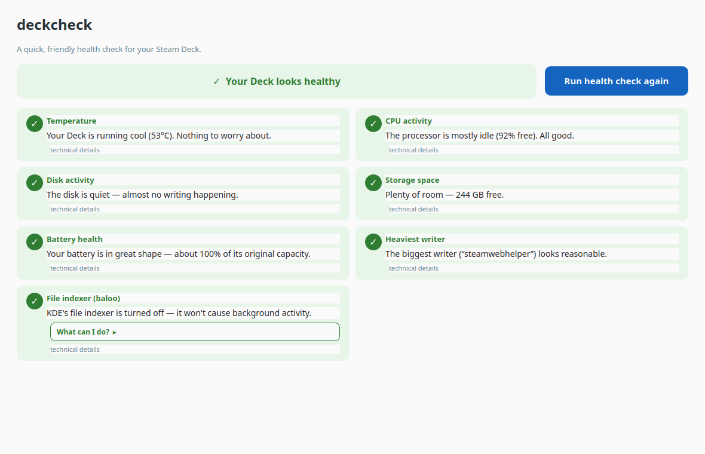

# deckcheck

[](https://github.com/eagredev/deckcheck/actions/workflows/ci.yml)
[](LICENSE)

A small, dependency-free health-check toolkit for the Steam Deck (and most Linux boxes):
a friendly desktop app *and* a set of command-line tools. It came out of a real
investigation: *"why is my Deck warm and its disk active while sitting idle?"*, which
turned out to be KDE's file indexer churning through ~860,000 files. These are the tools
that answered it, kept around so the next weird symptom takes one click instead of an
afternoon of forum-diving.



## Two ways to use it

deckcheck comes in two layers. Pick whichever fits you:

- **The GUI** (`gui/`) is a friendly desktop app. Click one button, get a plain-English
  health verdict, and for any problem it offers safe one-click fixes (each with a
  confirmation and an undo). **Start here if you're not comfortable in a terminal**; see
  [The GUI](#the-gui-no-terminal-needed) below.
- **The command-line tools** (`scripts/`) are plain bash, no dependencies, for when you
  want the raw numbers or to dig deeper. They're **read-only**: they observe and report,
  never change anything.

Same diagnostic brain underneath. The GUI's checks live in `gui/checks.py` (which also
runs standalone as a CLI); the bash scripts in `scripts/` are the deeper-dive layer. The
only part that *changes* your system is the GUI's optional fix buttons, and only after
you confirm, with an undo always offered.

## Quick start (command line)

```bash
git clone https://github.com/eagredev/deckcheck.git
cd deckcheck/scripts
./snapshot.sh          # what's going on right now?
```

The intended CLI workflow is two-stage: **snapshot first** to get the lay of the land,
then reach for a focused tool (thermal / disk / wakeups) if the snapshot points at
something. Prefer clicking? Jump to [The GUI](#the-gui-no-terminal-needed).

## Layout

- `gui/`: the desktop app. `checks.py` (the engine) plus `deckcheck_gui.py` (the Qt window) plus icons.
- `scripts/`: the command-line tools (plain bash, no dependencies beyond standard Deck/Linux utils).
- `flatpak/`: Flatpak packaging (manifest, AppStream metainfo, desktop file, launcher).
- `data/`: timestamped output from CLI `--save` runs, so nothing overwrites anything (local-only).
- `backups/`: config files copied before any change, so every change is reversible (local-only).

See [CONTRIBUTING.md](CONTRIBUTING.md) for how it all fits together.

## The tools

### `snapshot.sh`: what's going on right now
One-shot picture: load, CPU idle %, top processes (by CPU *and* memory), RAM/swap,
temps/fan/power, disk usage, live disk write rate, scheduled timers, and baloo status.
**Run this first.**

```bash
./snapshot.sh            # print to screen
./snapshot.sh --save     # also save a timestamped copy to ../data/
```

### `thermal_log.sh`: watch heat & load over time
Samples temps, fan RPM, APU power draw, CPU idle %, and the top process once a minute.
For intermittent problems a one-shot snapshot can miss.

```bash
./thermal_log.sh 60                       # log for 60 minutes (default)
./thermal_log.sh 30                        # or any number of minutes
nohup ./thermal_log.sh 60 >/dev/null 2>&1 &   # detached, survives a closed terminal
```

Writes a CSV to `../data/`. Columns that matter most:
- **apu_edge_C**: main chip temp. Healthy idle is ~48-52°C; climbing toward 70°C+ at idle means something's wrong.
- **cpu_idle_pct**: the trustworthy live load figure. Healthy idle is ~90%+.
- **top_proc**: what to blame on a spike. (Its %CPU is a lifetime average, so use it to identify *which* process, not as an exact number.)
- **fan_rpm**: 0 at cool idle; spinning means the chip is working.

### `diskhog.sh`: what's eating space & write-wear
Answers two questions at once: what's taking up **space** (biggest dirs), and what's
causing SSD **wear** (per-process lifetime writes + file-count hotspots). The file-count
view matters because huge piles of tiny files are what make indexers and sync tools
thrash, which is the exact shape of the baloo problem.

```bash
./diskhog.sh                      # scan $HOME
./diskhog.sh ~/.local/share/Steam # drill into a flagged subdir
./diskhog.sh --save [path]        # save a timestamped report
```

### `wakeups.sh`: what's poking the CPU at idle
On a handheld the idle question isn't "what's at 100%", it's "what keeps *waking* the
CPU", because frequent wakeups stop the chip reaching deep low-power states (battery +
heat). Samples `/proc/interrupts` over a window (no root needed); `--powertop` gives
deeper per-process data via sudo.

```bash
./wakeups.sh 10           # 10s interrupt-delta sample (no root)
./wakeups.sh --powertop   # deeper per-process wakeups (prompts for sudo)
./wakeups.sh --save 30
```

## The GUI (no terminal needed)

The command-line tools above are great if you're comfortable in a terminal, but a lot of
Steam Deck owners aren't, and they're exactly the people who most need to know *why* their
Deck is warm or busy. So deckcheck also ships a friendly desktop app.

It's a native Qt window that runs the health checks and explains the results in plain
English, colour-coded so anyone can read them at a glance:

- a single big **"Run health check"** button,
- an overall verdict banner (healthy / worth a look / needs attention),
- one card per check with a green/amber/red status and a sentence anyone understands
  (*"Your Deck is running cool, nothing to worry about"*).

The checks cover **temperature, CPU activity, disk activity, storage space, battery
health, the heaviest disk-writer, and KDE's file indexer.**

### "What can I do?": guidance, not just a verdict

A diagnostic that says *"investigate this"* abandons a non-technical user at the hard
part. So every warning has a **"What can I do?"** section that explains *what the thing
even is*, gives **numbered plain-English steps**, and where it's safe offers a
**one-click fix**. Examples: *Open Discover and finish its updates*, *Show me what's using
space*, or *Stop the file indexer churning through your games*.

Safety rules for the action buttons:
- **Only safe, reversible actions get a button.** (Steam/Proton writing a lot? Explained,
  but no button: you don't want a nervous user force-closing Steam.)
- **Every action confirms first** in plain English, showing what it does *and how to undo
  it*, before anything happens.
- **There's always an undo.** The file-indexer card, for instance, offers a recommended
  gentle fix, a full off-switch, *and* a **"Put file search back to normal"** button that
  restores the shipped defaults in one click, so nobody is ever stuck thinking they broke
  something.

### Install, option A: Flatpak (recommended)

The cleanest install, and the most at-home on a Steam Deck. Builds a self-contained app
(bundling Qt for Python) that appears in your application menu like any other app.

```bash
# Requires the KDE 6.10 runtime/SDK and the Flatpak builder:
flatpak install flathub org.kde.Platform//6.10 org.kde.Sdk//6.10 org.flatpak.Builder

# Build + install (run from the repo root):
cd deckcheck   # the folder you cloned
flatpak run org.flatpak.Builder --force-clean --user --install \
  build-dir flatpak/io.github.eagredev.deckcheck.yml

# Run (or just click the icon in your app menu):
flatpak run io.github.eagredev.deckcheck
```

See [`flatpak/README.md`](flatpak/README.md) for the packaging details and the
permissions it needs (and why).

### Install, option B: native venv

No Flatpak needed; installs a Python virtual environment inside this folder (SteamOS is
immutable, so nothing is installed system-wide) and adds a launcher.

```bash
./setup.sh             # creates a local venv + installs Qt for Python (PySide6)
./install-launcher.sh  # adds a clickable icon to the application menu
```

Either way it lands in the app menu under System/Utilities. **Double-click and go, no
terminal needed afterwards.**

### Run it directly (no install)

```bash
./gui/run_gui.sh       # uses the venv created by ./setup.sh
```

### Architecture note

`gui/checks.py` is the engine: pure-stdlib functions that gather a reading and return a
`Verdict` (status, plain-English headline, raw detail, and "what can I do?" guidance).
Each check is split into a thin *reader* (does the I/O) and a pure *judge* (turns the
reading into a `Verdict`), so the decision logic is unit-tested with synthetic readings;
see [`tests/`](tests/) (`python -m pytest tests/`). The Qt window is a thin presentation
layer that just renders verdicts, and `checks.py` also runs standalone as a CLI
(`python gui/checks.py`). Keeping all logic in one engine means the GUI never duplicates
or screen-scrapes the bash tools.

See [CONTRIBUTING.md](CONTRIBUTING.md) for how the pieces fit together, how to add a new
check, and the testing philosophy (logic is unit-tested; the GUI is verified by eye).

## Backups

The `backups/` folder is where deckcheck (and you) keep copies of config files taken
*before* changing them, so any change stays reversible. Its contents are machine-specific
and stay local; they aren't committed to the repo. To manually reverse anything
baloo-related at any time, run `balooctl6 enable` (it re-enables KDE's file indexer).

## Findings log

A running record of what these tools have turned up, both the headline incident and
anything notable since.

- **2026-06-03, the baloo incident (resolved).** Idle disk spikes, a pinned-100% CPU
  core, and a warm-at-idle chassis all traced to **baloo** (KDE file indexer) churning
  Steam game prefixes and ROM-hack decomp trees: ~860K files indexed, 318 GB written in
  19 days, one core at 100%. Fix: `balooctl6 disable` + purge. An hour-long `thermal_log`
  run confirmed healthy idle afterwards (~48°C, fan off, ~90%+ CPU idle).

- **2026-06-03, plasma-discover heavy writer (noted, unconfirmed cause).** The first
  `diskhog` run flagged `plasma-discover` (the KDE software store) with ~358 GB of
  lifetime writes, the single largest writer on the system, more than baloo was.
  Plausibly an over-eager background update/cache loop. Not yet investigated; logged here
  as the next thread to pull if disk-write noise returns.

## License

Apache License 2.0; see [LICENSE](LICENSE). It's permissive (use, modify, and redistribute
freely) with an explicit patent grant and a clear no-warranty / no-liability disclaimer, a
sensible fit for a tool that can change system state. deckcheck bundles no third-party
source; the optional GUI uses PySide6 (Qt for Python), distributed separately under the LGPL.
